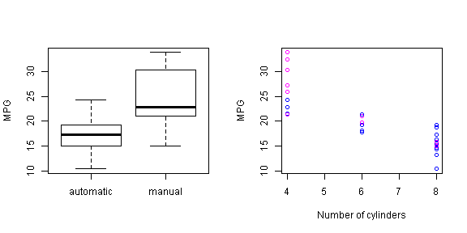
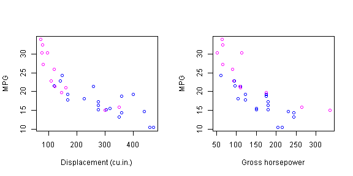
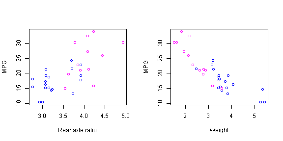
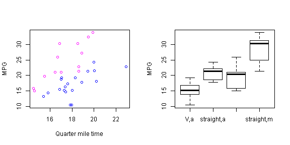
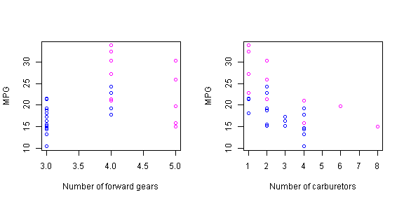

# The Effect of Transmission on MPG
## Overview
Our goal in this paper is to look at the mtcars data set and answer two questions:
* Is an automatic or manual transmission better for MPG?
* What is the quantitative difference in MPG between automatic and manual transmissions?

## Direct Relationship
We begin by plotting the available data with a simple box plot of miles per gallon (MPG) versus transmission (0 = "Automatic", 1 = "Manual") (see Appendix of Figures). This plot motivates us to build a linear regression for MPG over transmission.

We also plot the MPG against the individual variables. Whenever applicable, we color cars with manual transmissions magenta and cars with automatic transmissions blue (see Appendix of Figures). From the plots, we make some visual observations:
* Every variable appears to have some nonzero correlation with MPG.
* Some variables show grouping between automatic and manual transmissions, suggesting a connection between variables.
* Gross horsepower and displacement slightly display nonlinear relationships with MPG. 
After looking at the plots, we choose to build a second linear regression for MPG over weight, V/S engine, and transmission.

To keep the analysis short, we also build a third linear regression for MPG over at all available variables.


```r
modelOnAM <- lm(mpg ~ am, data = mtcars)
model <- lm(mpg ~ (wt + vs + am), data = mtcars)
#modelSOME <- lm(mpg ~ (wt + vs + am + hp + disp), data = mtcars)
modelALL <- lm(mpg ~ ., data = mtcars)
anova(modelOnAM, model, modelALL)
```

```
## Analysis of Variance Table
## 
## Model 1: mpg ~ am
## Model 2: mpg ~ (wt + vs + am)
## Model 3: mpg ~ cyl + disp + hp + drat + wt + qsec + vs + am + gear + carb
##   Res.Df RSS Df Sum of Sq    F  Pr(>F)    
## 1     30 721                              
## 2     28 216  2       505 35.9 1.7e-07 ***
## 3     21 147  7        69  1.4    0.26    
## ---
## Signif. codes:  0 '***' 0.001 '**' 0.01 '*' 0.05 '.' 0.1 ' ' 1
```

The ANOVA table informs us that the second model should be accepted over the first, and there is not enough statistical evidence to accept the third model over the second. We print the summary of the intermediate model: 

```r
summary(model)$coefficients
```

```
##             Estimate Std. Error t value  Pr(>|t|)
## (Intercept)   30.079     3.7480   8.025 9.710e-09
## wt            -3.784     0.8981  -4.214 2.363e-04
## vs             3.615     1.2761   2.833 8.454e-03
## am             1.491     1.4863   1.003 3.243e-01
```

## Results
Preliminary analysis shows that cars with manual transmission are expected to have 1.4913 higher MPGs than cars with automatic transmission, but comes with a p-value of .3242. As such, it is not clear whether or not the type of transmission has an impact on MPG.

Further analysis, outside the scope of this article, may also consist of the following:
* Research into the physical/mechanical relationships amongst the variables.
* Use nonlinear or locally linear models in place of linear models.
* Use principal components analysis.
* Plot variables against gallons per mile, the multiplicative inverse of MPG, and draw conclusions from there.

## Appendix of Figures

     
